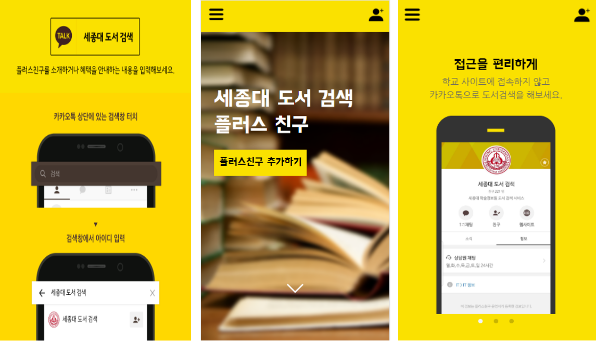

# 세종대 도서 검색 챗봇 서비스

## 프로젝트 소개

세종대학교 학술정보원에 있는 도서를 검색하여 도서 위치와 도서 대출 여부를 카카오톡으로 알려주는 서비스

## 프로젝트 소개 페이지(모바일 전용)
https://sejongbook.zoejoy.kr/

## 프로젝트 소개 영상
https://youtu.be/6JNkitsukrM/

## '세종대도서검색' 플러스친구 
http://pf.kakao.com/_YFgWC/

----

## 프로젝트 구성
- 사용 언어 및 프로그램
    - AWS Elastic Beanstalk
    - AWS ElastiCache
    - Celery
    - CSS/SASS
    - Django
    - Docker
    - JavaScript
    - PostgreSQL
    - Python
    - RDS
    - Redis
    - Route 53
    - Sentry
    - S3

- 주요 내용
    - 개발 환경 분리 (local/dev/production)
    - local/dev 환경에선 local redis 사용, production 환경에선 ElastiCache 사용
    - `runserver-mode.py`로 각 환경에 따른 runserver 실행 가능
    - `build.py` 파일로 각 환경에 따른 dockerfiles build 가능
    - `deploy.sh` 파일로 배포 실행
    - `.secrets` 폴더로 비밀키 관리
    - `django-json-secrets` 패키지를 활용하여 비밀키를 좀 더 편리하게 관리 (참고)[https://github.com/LeeHanYeong/django-json-secrets]
    - 발생된 오류 로그는 Sentry에 등록된 메일로 확인 가능

----

## Requirements
    raven<6.7
    beautifulsoup4<=4.6.0
    boto3<1.7
    celery==4.2.0
    Django<2.1
    django-extensions==2.0.7
    django-json-secrets==0.1.9
    django-storages==1.6.5
    lxml==4.2.1
    Pillow<6.0.0
    psycopg2-binary==2.7.4
    requests<2.19
    redis==2.10.6
    uWSGI==2.0.17

## AWS 환경 
- Python(3.6)
- S3 Bucket, 해당 Bucket을 사용할 수 있는 IAM User의 AWS AccessKey, SecretAccessKey
- RDS Database(보안그룹 허용 필요), 해당 database를 사용할 수 있는 RDS의  User,Password
- ElastiCache 사용을 위해 RDS 보안그룹에 Reids 포트 추가

-----

## Installation(Docker)
`localhost:8000`에서 확인

### 이전 환경
```
docker build -t eb-docker:base -f Dockerfile.local
docker run --rm -it 8000:80 eb-docker:local
```
이전 환경에선 각 모듈에 따른 dockerfile을 build하기 위해선 위와 같은 명령어들을 입력했었다.<br>
`build.py`파일을 통해 좀 더 편리하게 각 환경에 따른 docker images 를 생성하도록 변경했다.


### build base (base)
`Dockerfile.base` build하고, 지정한 dockerhub에 `sejong-docker:base`를 push 실
```
>> python build.py 
Select the mode you want to build
1. base
2. local
3. dev
4. production
Choice mode: 1
Successfully build base
....
Successfully push docker images
>> docker run --rm -it 8000:80 sejong-docker:base
```

### build local (local 환경)
```
>> python build.py 
Select the mode you want to build
1. base
2. local
3. dev
4. production
Choice mode: 2
Successfully build local
>> docker run --rm -it 8000:80 sejong-docker:local
```
### build dev (dev 환경)
```
>> python build.py 
Select the mode you want to build
1. base
2. local
3. dev
4. production
Choice mode: 3
Successfully build dev
>> docker run --rm -it 8000:80 sejong-docker:dev
```

### build production (production - AWS 배포 환경)
```
>> python build.py 
Select the mode you want to build
1. base
2. local
3. dev
4. production
Choice mode: 4
Successfully build production
>> docker run --rm -it 8000:80 sejong-docker:production

```

## Dockerhub 
```
docker build -t eb-docker:base -f Dockerfile.base
docker tag eb-docker:base <자신의 사용자명>/<저장소명>:base
docker push <사용자명>/<저장소명>:base
```
이후 Elasticbeanstalk을 사용한 배포 시, 해당 이미지를 사용
```Docker
# Dockerfile
FROM    <사용자명>/<저장소명>:base
```

-----

## Installation(Django runserver)
### 이전 환경 
```
expose DJANGO_SETTINGS_MODULE=config.settings.dev
pip install -r .requirements/dev.txt
python manage.py runserver
```
이전 환경은 django settings 모듈에 따라 위 명령어를 다르게 입력해야 하는 불편함이 있었다.<br>
이런 불편함을 최소화 하고자 `runserver-mode.py`을 이용하여 편리하게 `runserver`를 실행시킬 수 있다.

### local/dev/production 환경
```console
>> python runserver-mode.py
Select the mode you want to execute runserver mode
1. local
2. dev
3. production
Choice mode: <사용자가 원하는 모드 입력>
```

-----

## Installation(Celery & Redis)
- `local/dev`환경은 `로컬 redis` 서버 이용 
- `production`환경은 `ElastiCache redis` 서버 이용
- 각 환경에 따른 Docker image 실행시 `Redis`와 `Celery`는 background에서 실행

----

## Secrets
`.secrets/base.json`
```json
"SECRET_KEY" :"<Django settings SECRET_KEY value>",
"RAVEN_CONFIG": {
"dsn": "https://<sentry_Client_Keys>",
"release": "raven.fetch_git_sha(os.path.abspath(os.pardir))"
},
"SUPERUSER_USERNAME":"<superuser username>",
"SUPERUSER_PASSWORD":"<superuser user-password>",
"SUPERUSER_EMAIL":"<superuser user-email>",
"AWS_ACCESS_KEY_ID":"<AWS_ACCESS_KEY value> ",
"AWS_SECRET_ACCESS_KEY":"<AWS_SECRET_ACCESS_KEY value>",
"AWS_STORAGE_BUCKET_NAME":"<AWS_BUCKET_NAME>",
"AWS_S3_REGION_NAME":"<region name>, default='ap-northeast-2'",
"AWS_S3_SIGNATURE_VERSION":"<version>, default: s3v4",
"AWS_DEFAULT_ACL":"private",
"AWS_ELASTIC_CACHE":"<AWS_ELASTIC_CACHE 엔드포인트>"
```

`.secrets/dev.json & .secrets/production.json`
```json
{
  "DATABASES": {
    "default": {
      "ENGINE": "django.db.backends.postgresql",
      "HOST": "<자신의 RDS주소. ex)instance-name.###.region.rds.amazonaws.com>",
      "NAME": "<DB name>",
      "USER": "<DB username>",
      "PASSWORD": "<DB user password>",
      "PORT": "<Port number, default:5432>"
    }
  }
}
```
